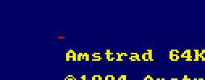
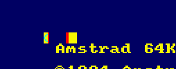
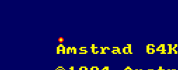
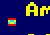
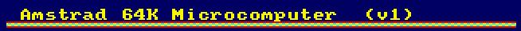
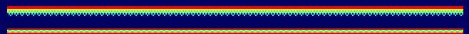
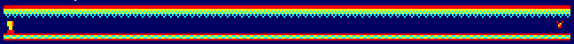
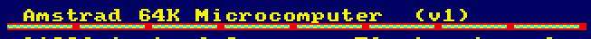
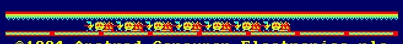
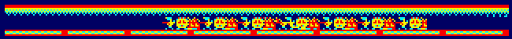

# DEZ80 Level 2

## 2.1.1 Progress bar

## 2.1.2 8x8 animation

## 2.2.1 Bullet

## 2.2.2 Press trap

## 2.2.3 Bouncing ball

## 2.3.1 Single floor tile

## 2.3.2 Tiled floor

## 2.3.3 Tiled roof

## 2.3.4 Shooting turret

## 2.4.1 Multi-tile floor

## 2.4.2 Static enemies

## 2.4.3 Moving enemies

