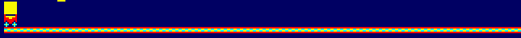
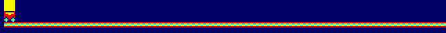
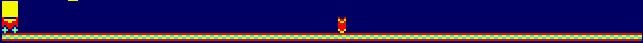
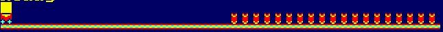
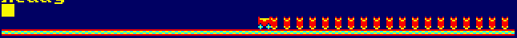
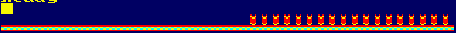
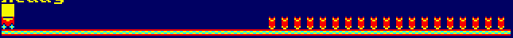
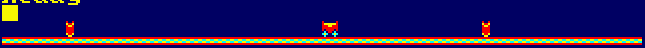

# 3.1.1 4 pixels

# 3.1.2 Mining cart

# 3.1.3 Floor

# 3.2.1 Moving cart

# 3.2.2 Moving cart with key

# 3.2.3 Moving cart with key (+ reset)

# 3.3.1 Barrel

# 3.3.2 Barrel repeat

# 3.3.3 Stop with space

# 3.3.4 Stop with space + explosion

# 3.4.1 Move right with key

# 3.4.2 Move with keys

# 3.4.3 Move with keys + screen limits

# 3.4.4 Move with keys + barrel collision

